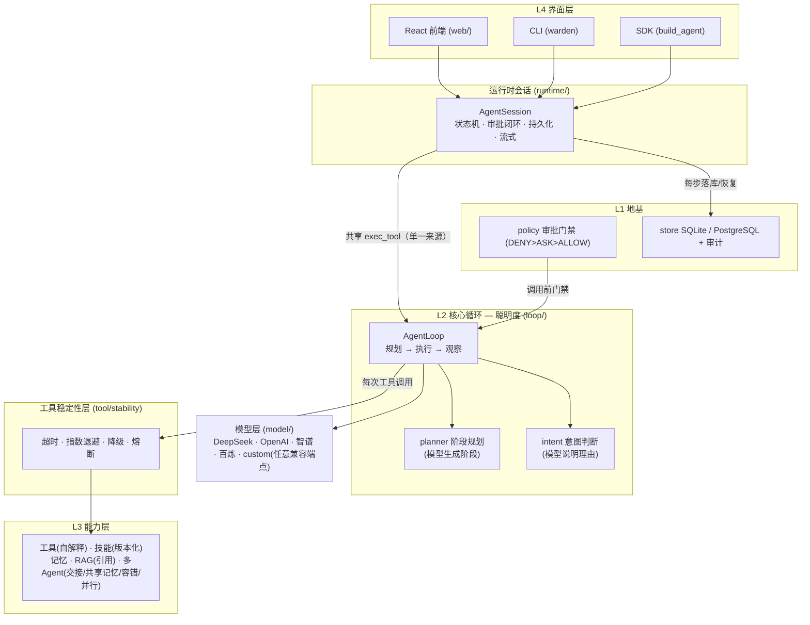

# Warden Agent

> 一套 **会思考、会自愈、扛得住** 的 Agent 运行时。
> 让 AI 干活像银行转账一样可控：**有状态、有边界、有门禁、能存档、能查账。**

[](https://github.com/kwny-io/warden-agent/actions)
[](https://github.com/kwny-io/warden-agent/actions)
[](./LICENSE)

> **招牌一句**:给定一个复杂任务,它自己会**拆**、会**查**、会**写**、会**自愈**——
> 不是"能聊天的助手",而是一个能自主规划、带引用检索、多 Agent 分工、扛得住故障的运行时。

## 三行接入（SDK 用法）

```python
pip install -e .           # 或 `pip install warden-agent`

from warden_agent.agent import build_agent
agent = build_agent(provider="deepseek", tools={...})   # 一行装配：模型+工具+策略+存储
reply = agent.chat("上海天气怎么样")                     # 直接对话
```

- `provider="deepseek"` 走真实模型；`provider=None` 走离线假模型（不花钱也能跑）。
- 传一个 Pydantic 类给 `agent.typed_reply(...)`，可拿到类型化结果。
- 命令行入口：`warden chat / approvals / approve / health ...`（见下文「怎么运行」）。

## 核心内容

让 AI 干活的过程，要像银行转账一样：**有状态、有边界、有门禁、能存档、能查账。**

## 接入你自己的模型（傻瓜式，零改源码）

想让它用真实模型，**不用改任何源码**，只要在项目根目录放一份 `.env`：

```bash
# 复制 .env.example 为 .env，填一项即可
DEEPSEEK_API_KEY=sk-你的key      # 或 OPENAI_API_KEY / ZHIPU_API_KEY / DASHSCOPE_API_KEY
```

- 已内置 **DeepSeek / OpenAI / 智谱 / 阿里百炼** 四家，填对应 key 就能跑（`provider="deepseek"` 等）。
- **接任意 OpenAI 兼容 API**（自建网关 / Ollama / 硅基流动…），用通用 `custom`，照样只填 `.env`，不写代码：

```bash
WARDEN_API_KEY=你的key
WARDEN_BASE_URL=https://你的兼容端点/v1
WARDEN_MODEL=你的模型名
```

然后 `build_agent(provider="custom")`。不设任何 key → 走离线假模型（不花钱也能跑）。

## 重点（三条主线，先看这个再看下面的功能表）

> 你真正在打磨的是一个**"会聪明干活、又扛得住真实世界"的 Agent 运行时**。下面所有模块
> 是从属于这三条主线的具体落地——不是平铺的一堆功能，而是三条线咬合成的骨架：

| 主线 | 讲什么 | 对应模块 |
|---|---|---|
| **① loop 聪明度** | 让 Agent "会思考、会自愈" | 阶段规划(模型生成) · 意图判断(模型说明理由) · 上下文管理 · 记忆取舍 · 工具失败自恢复 |
| **② 能力层** | 让 Agent "有本事、手够多" | 工具(自解释) · 技能(版本化) · 记忆 · RAG(来源引用) · 多Agent(共享记忆/容错/并行) |
| **③ 稳定性** | 让 Agent "扛得住真实世界" | 超时护栏 · 指数退避重试 · 统一降级兜底 · **熔断保护** |

**组合起来** = 聪明(loop) × 有本事(能力层) × 扛得住(稳定性)。下面的大表是这三条主线的落地清单。

## 架构图



> 读法：外面三层是"用得上"(L4) → "可靠安全"(L1 地基)；中间 **AgentSession 把"脑与手"委托给 AgentLoop**,
> 每次工具调用都过 **稳定性层**(超时/退避/降级/熔断)再进 **能力层**；模型可换成任意 OpenAI 兼容端点(custom,只填 `.env`)。

## 当前内容

| 模块 | 功能 | 状态 |
|---|---|---|
| 状态机 (`core/run`) | 受控的状态转换；仅通过命名行为变更，禁止任意跳转 | 已实现 |
| 模型抽象 (`model/model.py`) | 模型接口抽象，切换后端不影响上层 | 已实现 |
| 本地假模型 (`model/fake.py`) | 离线可用的确定性模型桩，供测试与无 Key 运行 | 已实现 |
| 真实模型 (`model/deepseek.py`) | openai SDK 接入 DeepSeek/OpenAI/智谱/百炼：流式、工具调用、结构化输出、usage | 已实现 |
| 工具管线 (`tool/catalog.py`) | 技能卡注册 + 冻结调用集；ToolSpec 自带 `triggers` 触发词元数据 | 已实现 |
| **工具稳定性层 (`tool/stability.py`)** | **工具调用全链路稳定性：超时护栏（卡死不停摆） + 指数退避重试（扛瞬时故障/限流） + 统一降级兜底（重试耗尽走 fallback） + 熔断保护（连续失败自动短路，冷却后半开试探），配了才生效** | 已实现 |
| **工具自解释 (`tool/trigger.py`)** | **从工具描述自动提取触发词（英文词 + 中文双字 + 滤泛词），intent/skill 路由不再手配映射——能力"长"进系统** | 已实现 |
| 执行循环 (`loop/loop.py`) | 主循环，含审批门禁 | 已实现 |
| loop 深度① 失败自恢复 (`loop/loop.py`) | 工具错误喂回模型自纠，带重试上限 | 已实现 |
| loop 深度② 记忆取舍 (`loop/loop.py`) | 按需取用 + 启发式取舍写入 | 已实现 |
| loop 深度③ 阶段规划 (`loop/planner.py`) | 复杂任务自动拆阶段、渐进注入阶段目标；**复杂度判定为"复杂"时由模型生成阶段**（离线降级回通用模板） | 已实现 |
| loop 深度④ 上下文管理 (`loop/loop.py`) | 超长裁剪 + 早期摘要 | 已实现 |
| loop 深度⑤ 意图判断 (`loop/intent.py`) | 调用前校验"该不该调、调哪个"，防误调/防打转；**无触发信号时让模型说明理由** | 已实现 |
| SQLite 持久化 (`store/sqlite.py`) | 存档点 + 线程安全 + 待审批持久化 | 已实现 |
| 审批策略 (`policy/policy.py`) | DENY > ASK > ALLOW 门禁 | 已实现 |
| 运行时会话 (`runtime/session.py`) | 状态机恢复 + 审批闭环 + 类型化结果 | 已实现 |
| HTTP/SSE 服务 (`web/`) | 将 Agent 暴露为 API（对话/审批/事件流） | 已实现 |
| 认证/审计/健康检查 (`web/`) | Bearer 认证、审计账本、liveness/readiness 探针 | 已实现 |
| HTTP 契约 (`web/server.py`) | 统一版本头、Idempotency-Key 幂等、统一错误码 | 已实现 |
| 命令行 CLI (`cli.py`) | `warden` 命令：chat/stream/approvals/approve/reject/health/coding | 已实现 |
| RAG 知识检索 (`rag/`) | 向量库 + knowledge.search 工具 | 已实现 |
| **RAG 引用 (`rag/knowledge.py`)** | **检索结果带来源引用(SourceHit)，Agent 回答可溯源（据《某文档》）** | 已实现 |
| 多 Agent (`multiagent/`) | 主管模式（子 Agent 包装为工具） | 已实现 |
| **多 Agent 结构化交接 (`multiagent/supervisor.py`)** | **专员间用结构化交接单（角色/任务/结论）交接，干净可复核** | 已实现 |
| **多 Agent 共享记忆 (`multiagent/supervisor.py`)** | **专员共用一个 WORKSPACE 工作记忆（研究员写入→写手读到），共享上下文、避免重复查** | 已实现 |
| **多 Agent 容错降级 (`multiagent/supervisor.py`)** | **子 Agent 失败 → 重试 / 换备用专员 / 降级，不再整体崩溃** | 已实现 |
| **多 Agent 并行/串行分派 (`multiagent/dispatch.py`)** | **确定性分派器：线程池真并行，或按依赖串行；不靠模型脑补，离线可测** | 已实现 |
| 技能系统 (`skill/`) | SKILL.md 协议 + 渐进披露 + 信任快照 | 已实现 |
| **技能版本化 (`skill/skill.py`)** | **同一技能多版本并存，`find(alias, version=None)` 默认取最新；目录支持 `<alias>/<version>/SKILL.md` 约定** | 已实现 |
| **技能触发 (`skill/trigger.py`)** | **按任务意图打分选出该用的技能（skill.trigger.pick，渐进披露的"触发判断"）；匹配信号与意图路由同源，暴露工具自带 triggers** | 已实现 |
| 可换存储 (`store/base.py`+`postgres.py`) | SQLite/PostgreSQL 可互换 | 已实现 |
| Docker 部署 | Dockerfile + docker-compose | 已实现 |
| 可视化控制台 (`web/static/`) | 内置演示控制台（浏览器对话 + 审批页面） | 已实现 |
| **Web 前端产品化 (`web/`)** | **React + TypeScript + Tailwind CSS + Vite 交互式控制台**：SSE 流式打字机、审批队列、信息面板；由 FastAPI 单端口托管 SPA | 已实现 |
| 配置加载 (`core/config.py`) | .env 加载，密钥不进代码 | 已实现 |
| 迁移体系 + Codec (`store/`) | schema 版本化演进，老库数据兼容 | 已实现 |
| 凭证加密 + 租约 (`credential/`) | AES-GCM 落库加密 + 短租约 + 脱敏 | 独立能力（未接入主链） |
| Checkpoint/门禁 (`runtime/`) | 断点恢复 + 失败重试 + 完成前校验 | 独立能力（未接入主链） |
| 受控执行 (`execution/`) | 受管子进程 + 输出/超时/并发预算 | 独立能力（未接入主链） |
| 执行沙箱 (`execution/sandbox.py`) | 只读工作区 + 默认禁网 + 资源限制（POSIX rlimit / Windows Job Object） | 独立能力（未接入主链） |
| SDK 面 (`agent.py`) | build_agent() 一键装配；typed_reply(); pydantic_tool | 已实现 |
| 记忆 (`memory/`) | 多作用域 + 候选确认 + 冲突消解 + 审计 | 已实现 |
| MCP 客户端 (`mcp/`+`ts/mcp-client`) | TS SDK 连 MCP，工具先行审查再导入 | 已实现 |
| Web 搜索/抓取 (`web/search.py`) | 多 provider 可插拔 + URL 策略 | 已实现 |
| Git 集成 (`git/`) | revision 探测 + unified-diff 应用 + 合并门禁 | 已实现 |
| Coding Agent (`coding_agent/`) | 需求→读代码→出 diff→门禁落地 | 已实现 |
| 架构边界测试 (`tests/`) | AST 校验依赖单向 | 已实现 |

> **接线实情**：标注「独立能力（未接入主链）」的模块（凭证加密 / Checkpoint·恢复 / 受控执行·沙箱）是
> 已写好、有真实价值的**独立能力**，但尚未接进产品主路径（`build_agent`/HTTP/CLI）——它们不冒充已接入，
> 也不删除（留给以后按需接线）。其余「已实现」的模块都在主链里真实生效。


## 工程化规范

- **打包**：`pyproject.toml`（hatchling，`src/` 布局）
- **类型检查**：`mypy --strict`（`Success: no issues found`）
- **静态检查**：`ruff`（`All checks passed`）
- **测试**：`pytest`（**288 个测试全过**，覆盖状态机、工具、循环、DeepSeek、审批、恢复、HTTP 服务、SSE 流式、RAG、多 Agent、存储接口、迁移/codec、凭证加密+租约、Checkpoint/门禁、受控执行、Pydantic 工具、typed_reply、build_agent、记忆、技能、MCP、web 搜索、Git、架构边界、能力集成、多模型、配置加载、**认证/审计/健康检查**、**loop 阶段规划/意图判断、RAG 引用、多 Agent 结构化交接/共享记忆/容错降级/并行分派、技能触发/版本化、工具自解释、工具稳定性层(超时/退避/降级/熔断)、端到端演示**；Postgres 集成测试无库时自动跳过，MCP 集成测试无 node 时自动跳过，Git 集成测试无 git 时自动跳过）
- **`.gitignore`**：自动忽略缓存、`.env`、密钥、数据库文件、日志
- **CI**：`.github/workflows/ci.yml` 在每次 push 跑 `ruff` + `mypy --strict` + `pytest`（见顶部徽章）
- **License**：MIT（见 [LICENSE](./LICENSE)）

## 怎么运行

```bash
cd /d/warden-agent
py -m pytest tests/ -q        # 跑全部测试（同 pytest）
```

### 1. 命令行跑真实 DeepSeek（让项目"活"）

先设置 API Key（PowerShell）：
```powershell
$env:DEEPSEEK_API_KEY = 'sk-xxxx'
```
```powershell
cd /d/warden-agent
py -c "from warden_agent.demo import run_deepseek_demo; run_deepseek_demo()"
```

想看**流式（打字机）效果**：
```powershell
py -c "from warden_agent.demo import run_stream_demo; run_stream_demo()"
```

想看**一键装配 + 类型化结果**（build_agent，离线也能跑）：
```powershell
py -c "from warden_agent.demo import run_build_agent_demo; run_build_agent_demo()"
```

### 2. 启动 HTTP/SSE 服务（对外暴露）

```powershell
cd /d/warden-agent
py -m warden_agent.web.run_server
```
- 打开 **http://127.0.0.1:8000/** 是可视化演示控制台（浏览器里对话 + 审批按钮）
- 打开 http://127.0.0.1:8000/docs 看交互式 API 文档
- `POST /chat/run-1` 送一句话 → 返回最终回答或"需要审批"
- `GET /approvals` 看审批队列，`POST /approve/run-1` 批准 / `POST /reject/run-1` 拒绝
- `GET /events/run-1` 监听 SSE 事件流
- 设了 `DEEPSEEK_API_KEY` 就接真模型；不设则用离线假模型（不花钱）

**想开认证 / 审计 / Git**（环境变量）：
```powershell
$env:WARDEN_API_KEY = 'sk-你的服务密钥'   # 设了才开认证（请求需带 Bearer key），不设=本地开放
$env:WARDEN_AUDIT = '1'                  # 开审计（写 SQLite audit_log 表）
$env:GIT_WORKDIR = 'D:/warden-agent'  # 把一个 git 仓库暴露成 git.apply_patch 工具
py -m warden_agent.web.run_server
```
加上后还能访问：
- `GET /health/live`、`GET /health/ready` —— 存活 / 就绪探针（负载均衡探活用）
- `GET /audit`（需 Bearer key）—— 查看审计轨迹（谁在何时对哪个会话做了什么）

### 3. CLI 命令行（warden）

先启动上面的 HTTP 服务，再开一个终端用 `warden` 命令（需先 `pip install -e .`）：
```bash
warden health                        # 健康检查
warden chat my-run "你好，介绍下自己"   # 对话（遇到危险操作会提示审批）
warden approvals                     # 查看待审批队列
warden approve my-run                # 批准
warden reject my-run                 # 拒绝
warden coding "给 hello.py 加一个 greet 函数"   # 本地跑一个编码需求（读代码→出diff→门禁落地）
```
- 默认连 `http://127.0.0.1:8000`，可用环境变量 `WARDEN_BASE_URL` 覆盖；本地命令 `coding` 不需服务。
- `chat` 触发审批时会提示"需要审批"，接着用 `warden approvals` 看、`warden approve/reject` 决定——审批门禁在命令行里也是闭环的。
- 直接可执行也可：`python -m warden_agent.cli health`。

### 4. 端到端完整演示（L2 聪明 loop × L3 能力层）

把「阶段规划 + 工具意图判断」（loop 深度③⑤，复杂任务阶段由模型生成、无触发信号由模型说明理由）
与「RAG 引用 + 多 Agent 结构化交接 + 技能触发」（能力层）整条串起来，且工具触发词从描述自动提取（工具自解释）。
有 `DEEPSEEK_API_KEY` 走真模型端到端；没有也能走**离线自主闭环**——
用一个脚本化模型驱动真实的 AgentLoop，主管真的派 research → 调研员真的查知识库（带来源引用）
→ 真的产出结构化交接单 → 主管派 write → 写手成稿 → 汇总收尾，整条 plan→act→observe 链路
**真实发生并打印轨迹**（不是分节摆拍）。随后再分节拆解每一层能力加深理解。

```powershell
cd /d/warden-agent
py -m warden_agent.demo_e2e
```
