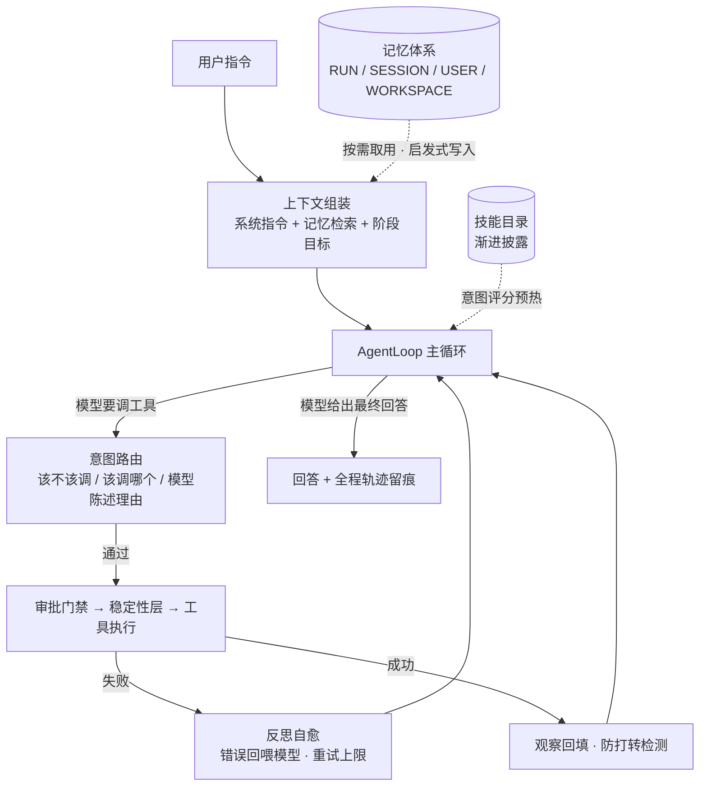
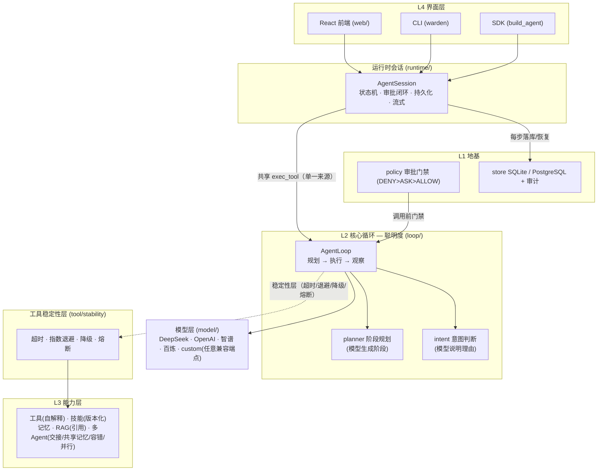

# Warden Agent

> 面向生产环境的 **可恢复、可治理** Agent 运行时（Agent Runtime）。
> 主流框架解决"Agent 有没有本事"，Warden 解决"Agent 敢不敢用"——
> 智能循环（规划 / 路由 / 自愈）× 多 Agent 协作 × RAG 溯源 × 执行治理与稳定性工程。

[](https://github.com/kwny-io/warden-agent/actions)
[](https://github.com/kwny-io/warden-agent/actions)
[](./pyproject.toml)
[](./pyproject.toml)
[](./LICENSE)

⚡ **30 秒体验**：`pip install -e . && python -m warden_agent.demo_e2e`
——**无需任何 API Key**，离线自主闭环：多 Agent 派工、知识检索、结构化交接，全程轨迹打印。

<!-- TODO(演示图): 录制 React 控制台或 demo_e2e 的 GIF，放到 docs/demo.gif 后取消下行注释

-->

## 核心亮点

### ① 会思考的认知循环——自己拆任务、自己纠错、自己分工

- **阶段规划**：复杂任务自动拆解为带目标的阶段、渐进注入推进；复杂任务的阶段由**模型生成**，
  离线降级为模板
- **意图路由**：调用前校验"该不该调、调哪个"；触发信号不足时**让模型陈述理由**——工具选择
  可解释、可审计，不是黑盒
- **反思自愈**：工具失败不崩溃，错误喂回模型自我纠正（带重试上限）；同一调用原样重发会被
  判定为打转并提示换策略
- **多 Agent 协作**：主管派工 + 结构化交接单 + 共享工作记忆 + 确定性并行分派，详见下文
  「Agent 智能架构」

### ② 执行治理五件套——有状态、有门禁、有账可查、可恢复、有契约

| 治理机制 | 对应传统系统设施 | Warden 的实现 |
|---|---|---|
| 受控状态机 | 事务状态约束 | 生命周期仅可经命名行为迁移，禁止任意跳转 |
| 审批门禁 | 风控与授权 | `DENY > ASK > ALLOW` 策略引擎，高危调用挂起待审，HTTP / CLI / 前端三端同一闭环 |
| 审计账本 | 操作审计 | 谁、何时、对哪个会话做了什么，落库可查 |
| 断点恢复 | 冲正与续作 | 每步落库 + 存档点，进程重启后续跑 |
| 服务契约 | 幂等与版本管理 | `Idempotency-Key` 幂等、统一版本头、problem+json 统一错误码 |

### ③ 工具稳定性层——把微服务 SRE 工程引入每一次工具调用

多数实现把重试与容错写在业务代码里；Warden 将其下沉为运行时的统一层，作用域是**每一次
工具调用**：超时护栏（卡死不停摆）→ 指数退避重试（扛瞬时故障与限流）→ 统一降级兜底
（重试耗尽走 fallback）→ 熔断保护（连续失败自动短路，冷却后半开试探）。

> **已接入产品路径。** `build_agent` / `build_app` 均可传 `stability`，产品入口 `run_server`
> **默认开启**（`WARDEN_STABILITY=0` 关）。重试是安全的：按 `ToolSpec.pure` 判定，
> **非纯工具只对瞬时错误重试**，不会把 `fs.delete` 这类有副作用的操作重放。

### ④ 可测试性与评测是设计出来的，不是补出来的

- **离线确定性模型桩**：不配置任何 API Key 即可驱动完整链路——805 项测试零网络、零成本、
  可重复运行，正面回应 LLM 应用"测试靠真模型又贵又不稳定"的难题
- **Agent 评测黄金集**：意图路由（12 例）/ 技能触发（8 例）/ 端到端任务（10 例）三类黄金集，
  `python -m warden_agent.evals` 一键出报告，通过率可作 CI 质量门禁
- **确定性多 Agent 分派**：并行 / 串行由显式依赖决定，不依赖模型自由发挥，结果离线可复现
- **AST 架构边界测试**：分层依赖的单向性由测试守护，架构不靠自觉
- **mypy --strict 全量零错误**：87 个源文件在严格模式下通过类型检查

### ⑤ 能力"注册即路由"——自解释的工具与技能

工具触发词从描述自动提取（英文词元 + 中文双字 + 停用词过滤），新工具注册即可被意图路由命中，
无需手工维护映射表；意图判断在调用前校验"该不该调、调哪个"，无显式触发信号时由模型陈述
理由——**让每一次工具调用都带得通解释**。技能系统同源复用该信号：按意图评分选技能、
多版本并存、渐进披露。

### ⑥ 纵深防御——从策略层到执行层到存储层

- **接入层（fail-closed）**：启动时既没有 `WARDEN_API_KEY`、也没有显式 `WARDEN_ALLOW_ANON=1`
  → **拒绝启动**；监听非本机地址却不带鉴权 → 同样拒绝启动。因为 `/approve`、`/reject` 是
  人工审批闸门的入口，接口无鉴权时调用方就能自己批准自己的高危操作。
- **策略层**：审批门禁决定"能不能调"
- **边界层**：工具 workdir 边界校验（防路径穿越）、Web 检索 URL 策略决定"能碰到哪"
- **执行层**：沙箱分两档，**不混为一谈**——语义档（只读副本 + NetworkPolicy 正则，跨平台）；
  内核档（Linux + `unshare -rn` 网络命名空间，子进程根本没有网络栈）。
  档位探测是**功能性的**：真的试跑一次命名空间，而不是查 `unshare` 在不在——
  **"有这个二进制" ≠ "有权用它"**（默认 Docker 容器里会 `Operation not permitted`，
  实测确认）。给不了就**如实降级**并提示 `需 --cap-add SYS_ADMIN`，绝不谎报"已隔离"。
  `isolation_note()` 报出当前档位；资源限制经 POSIX rlimit / Windows Job Object。
  ⚠️ **内核档与容器边界默认互斥**：容器里要用内核档就得加 `SYS_ADMIN`，那会削弱容器本身。
  所以是二选一——用容器当边界（推荐），或用内核档跑在宿主/CI 上。
- **凭证层**：模型的 API Key 由 `CredentialBroker` 保管——**AES-GCM 加密 + 短租约 + 密文落库**
  （`credentials` / `credential_leases` 表，见 `credential/vault.py`）：导入的 key 不再明文躺在
  进程内 dict 里，也不随进程退出而丢失；租约只落元数据，取用时回查密文现解，**明文不落盘**。
  按调用者身份分作用域——同租户的 A 用户读不到 B 用户导入的 key。
  `SecretRedactor` 把密钥从日志中抹掉；密钥材料取 `WARDEN_CREDENTIAL_KEY`（未配置时退化为
  进程内临时密钥并**明确告警**，不假装持久化）
- **多租户（仅鉴权模式）**：`WARDEN_API_KEYS=alice:k1,bob:k2` 让每个 key 绑定一个身份，
  **身份由服务端从 key 推出，客户端无法自称**；针对他人 Run 的读 / 写 / 删 / 审批一律 403，
  `/runs`、`/approvals`、`/audit` 按调用者收敛。⚠️ 匿名开发模式（`WARDEN_ALLOW_ANON=1`）
  保留 `?user_id=` 只为切换演示账号，**不是安全边界**——口径详见下方「部署边界」
- **限流**：进程内固定窗口限流，默认每调用者 60 秒 600 次（`WARDEN_RATE_LIMIT=次数/秒数`，`0` 关），
  超限返 429 + `Retry-After`，健康探针豁免
- **出站限速/配额**（**方向相反的另一道闸**）：入站限流保护服务不被客户端打垮，
  出站闸门保护**外部世界、你的出口 IP 和计费额度**不被你自己的 Agent 打垮——
  单次请求的超时/体积上限只界定"一次"，不界定"多少次"。默认开：全局 120/60s、
  单 host 20/60s、并发 8，日配额按需开（`WARDEN_OUTBOUND_*`）；被限流返回可读文本
  而非抛异常，**URL 策略先于闸门**（被拒的 URL 不占配额）
- **可水平扩展**：幂等表 / SSE 事件流 / 限流计数抽成可插拔实现（`web/coordination.py`）——
  单副本走进程内（默认，零延迟），多副本设 `WARDEN_SHARED_STATE=1` + PostgreSQL 即放进共享存储，
  幂等、事件流、限额**全局一致**；恢复工作进程（`runtime/worker.py`）负责把崩溃的 Run 真正续跑
- **容器层**：`Dockerfile` 多阶段构建 + **非 root 运行** + `HEALTHCHECK`；
  `docker-compose.yml` 里 `read_only` / `cap_drop: ALL` / `no-new-privileges` / 只发布到回环

> 📐 **部署边界与多租户口径**（单副本 vs 多副本的开关、进程内状态清单、缩容/扩容注意项）：
> 见 [docs/deployment-boundaries.md](./docs/deployment-boundaries.md)。

### ⑦ 模型无关——"大脑"可整体替换，治理与循环才是资产

- **四家内置**：DeepSeek / OpenAI / 智谱 / 阿里百炼，`.env` 填对应 key 即切换
- **custom 通用提供商**：零改源码接入**任意 OpenAI 兼容端点**（自建网关 / Ollama / vLLM / 硅基流动等）
- **实例直接注入**：`build_agent(provider=model)` 接受模型实例，多模型路由、灰度切换、测试替身皆宜
- **离线确定性模型桩**：不配任何 key 也能全链路运行与测试——这也是"模型可替换"的最终形态

## Agent 智能架构

Warden 的智能层不是"一次 prompt 调用"，而是一个带规划、路由、反思与记忆的完整认知循环。
按行业术语对应：ReAct 循环（工程化）· Plan-and-Execute 规划 · 反思自愈（Reflection）·
分层记忆 · 上下文工程 · 主管模式多智能体（Supervisor）。



**① 认知循环（ReAct 的工程化）**：感知 → 规划 → 路由 → 执行 → 观察。每一次工具调用前有
意图校验、中有稳定性层、后有观察回填；循环次数有上限，杜绝死循环。

**② 任务规划（Plan-and-Execute）**：先以确定性启发式判定任务复杂度；复杂任务拆解为带
目标的阶段（TaskPlan），阶段目标**渐进注入**——模型始终知道"当前在哪一步、下一步去哪"，
而不会闷头一口气做到忘掉全局。复杂任务的阶段计划由模型生成，离线时降级为通用模板；
规划全程留痕（role=system），与"可查账"纪律一致。

**③ 意图路由（可解释的工具选择）**：调用前校验"该不该调、该调哪个"。触发信号缺失时注入
提醒让模型确认或改选——**非阻断、可协商**，而非硬拒绝；同一"工具名 + 参数"成功调用重复
出现时判定为打转，提示模型换策略；无显式信号时由模型**陈述调用理由**。工具选择因此是
可解释、可审计的，不是黑盒。

**④ 反思自愈（失败是输入，不是异常）**：工具执行失败时，错误信息喂回模型自我纠正，带
按工具的重试上限；超上限则明确告知"此路不通"，促使换策略。实现细节：失败的调用不计入
打转签名——避免短路重试机制，这是绕不过去的工程分寸。

**⑤ 记忆体系（四级作用域 + 写入取舍）**：

- 作用域：`RUN`（单任务）/ `SESSION`（会话）/ `USER`（跨会话用户级）/ `WORKSPACE`
  （多 Agent 共享工作记忆）
- 取用端：按当前问题检索相关记忆注入上下文，按需取用而非全量倾倒
- 写入端：启发式判断"值不值得记"，值得才进入候选区，经确认后生效
- 配套：冲突消解、派生记忆（总结）、全程审计事件

**⑥ 上下文工程**：超长历史裁剪 + 早期内容压缩为要点摘要；与规划层的"阶段渐进注入"配合，
长任务的上下文占用保持有界——模型不会"越干越忘"。

**⑦ 多智能体（Supervisor + 结构化交接 + 确定性分派）**：

- **主管模式**：子 Agent 封装为工具，由主管调度
- **结构化交接单**：专员产出以（角色 / 任务 / 结论）结构化交接，干净可复核，不做全文灌水
- **共享工作记忆**：专员共用 WORKSPACE 记忆（研究员写入 → 写手直接读到），避免重复检索
- **容错降级**：子 Agent 失败 → 重试 / 切换备用专员 / 降级，不整体崩溃
- **确定性分派器**：独立任务线程池真并行、有依赖按序串行，纯代码路径、离线可精确测试；
  与主管组合成"主管动脑分工，分派器确定执行"

**⑧ RAG 与技能（让知识按需进入上下文）**：RAG 检索结果携带来源引用（SourceHit），回答
可溯源；技能系统（SKILL.md）采用渐进披露——平时只在目录，按任务意图评分预热、确认后才
注入正文，技能多版本并存、默认解析最新版本。

两条接线上的诚实说明：

- **RAG 已接进产品路径**（此前只在 demo/评测里用，模型拿不到 `knowledge.search`）：
  `build_agent(knowledge=...)` / `build_app(knowledge=...)` / `WARDEN_KNOWLEDGE=1|<文档目录>`。
  默认嵌入器是**离线词频哈希**——**词面匹配，不是语义检索**（换了说法问就会掉分，
  作者在代码里标注了实测对比）；要真语义请配 `WARDEN_EMBED_BASE_URL` 等三项走兼容端点。
  启动日志会写明当前用的是哪一种，避免"在词频嵌入下宣称语义检索"。
- **记忆默认落盘**：`build_agent(memory=True)` / HTTP 服务用 `SqliteMemoryStore`，
  `USER` 作用域（跨会话用户级记忆）才真的记得住；不传记忆库时是进程内实现（重启即丢）。
  召回按**关键词重叠**匹配，不是向量召回。

## 为什么需要 Warden

多数 Agent 框架止步于"能跑通一次对话"。进入真实业务后，需要回答的是另一类问题：
执行到一半进程崩溃了如何恢复？工具即将执行高危操作时由谁拦截？某次调用改了什么、由谁批准？
这些问题不解决，Agent 就无法进入生产。

Warden Agent 把**执行治理**作为一等公民：状态机约束执行生命周期、审批门禁提供
Human-in-the-loop 闭环、每一步持久化并留审计痕迹、存档点支持断点恢复。在此地基之上，
再叠加规划循环（阶段规划 / 意图判断 / 失败自愈）、能力层（工具 / RAG / 多 Agent / 技能）
与工具稳定性工程（超时 / 退避 / 降级 / 熔断）。

**典型场景**：需要审批留痕与审计合规的企业自动化；金融、政务等高危操作必须人工复核的行业；
Coding Agent 的 diff 门禁落地（不自动 commit/push，改动留成候选，人工决定）。

## 与主流框架的定位差异

| 路线 | 代表 | 核心问题 | 留给运行时的空白 |
|---|---|---|---|
| 能力编排框架 | LangChain / LlamaIndex | 如何组合模型、工具、RAG | 执行过程缺乏状态约束、门禁与审计 |
| 自主智能体 | AutoGPT / MetaGPT | 如何让 Agent 自主完成任务 | 失控风险高，难以进入受监管环境 |
| 图编排与检查点 | LangGraph | 可控的图执行与人工中断 | 验证了治理路线；审计、凭证、沙箱、稳定性仍需自行拼装 |

Warden 把这些空白收进一个统一运行时，并坚持一条纪律：**治理与稳定性不是可选项，而是每一次
工具调用的固定管卡**。检查点与人工中断已由 LangGraph 验证是正确方向——Warden 在同一方向上
提供更完整的体系化实现，并保持零依赖离线可测。

## 架构



层次说明：L4 提供三种等价接入形态（SDK / CLI / Web）；运行时会话 `AgentSession` 负责状态机、
审批闭环与持久化，与 `AgentLoop` **共享 `exec_tool`（工具执行的单一来源）**。
两套循环**还共用 `loop/cognition.py` 的认知实现** —— 阶段规划、意图路由、记忆按需取用、
上下文裁剪四项在产品路径（HTTP / CLI / 流式）上**同样生效**，不再只属于 demo：
- **意图路由**：`ToolIntentRouter` 纯离线确定性 → 产品入口**默认开启**（调用前校验"该不该调"）
- **上下文裁剪**：防长会话撑爆上下文 → **默认开启**（`WARDEN_MAX_CONTEXT_CHARS` 可调）
- **阶段规划**：`ModelPlanner` 会为复杂任务多花一次模型调用 → **默认关闭**（`WARDEN_PLANNER=1` 开）
- **记忆按需取用**：按关键词重叠只注入相关记忆，且**每次请求临时注入、不写进存档**

**工具稳定性层（超时 / 退避 / 降级 / 熔断）已接入工具执行链**：`build_agent` 与
`build_app` 都可传 `stability`，产品入口 `run_server` **默认开启**（`WARDEN_STABILITY=0` 可关）。
它按 `ToolSpec.pure` 判定 —— **非纯工具只对瞬时错误重试**，不会把有副作用的操作
（如 `fs.delete`）重放。审批门禁与持久化
作为地基贯穿全程。
模型层面向 OpenAI 兼容协议抽象，可整体替换为任意兼容端点。

## 快速开始

环境要求：Python ≥ 3.12。

```bash
git clone https://github.com/kwny-io/warden-agent.git
cd warden-agent
uv sync --frozen --extra dev     # 按 uv.lock 装（**版本可复现**）；不想用 uv 也可 pip install -e ".[dev]"
```

不配置任何模型密钥时，自动使用内置的离线确定性模型——循环、工具、审批、持久化等完整链路
可零成本运行与测试：

```python
from warden_agent.agent import build_agent

agent = build_agent()                     # 离线模式：确定性模型桩，不产生调用费用
print(agent.chat("上海天气怎么样"))
```

需要结构化输出时，将 Pydantic 模型交给 `typed_reply`：

```python
from pydantic import BaseModel

class Weather(BaseModel):
    city: str
    temp_c: float

result = agent.typed_reply(Weather, "上海现在多少度？")
```

`build_agent` 一行完成装配（模型 + 工具 + 策略 + 存储），并支持可选能力开关：
`memory`（记忆）、`skills`（技能）、`web`（联网检索）、`mcp_server`（MCP 工具源）、
`git_workdir`（Git 门禁工具）、`sandbox`（受控 `shell.run` 工具：只读副本 + 默认禁网 +
超时与输出预算约束）。

## 模型接入

在项目根目录放置 `.env`（参考 [.env.example](./.env.example)），密钥不进代码、不进仓库。
已内置四家 OpenAI 兼容提供商，填对应 key 即可切换：

| 提供商 | `provider` 取值 | 环境变量 |
|---|---|---|
| DeepSeek | `"deepseek"` | `DEEPSEEK_API_KEY` |
| OpenAI | `"openai"` | `OPENAI_API_KEY` |
| 智谱 GLM | `"zhipu"` | `ZHIPU_API_KEY` |
| 阿里百炼 | `"bailian"` | `DASHSCOPE_API_KEY` |

接入任意 OpenAI 兼容端点（自建网关 / Ollama / vLLM / 硅基流动等）**无需修改源码**：
在 `.env` 中配置三项，然后使用通用 `custom` 提供商：

```bash
WARDEN_MODEL_API_KEY=你的模型key     # ⚠️ 不是 WARDEN_API_KEY（那是服务端鉴权密钥）
WARDEN_BASE_URL=https://你的兼容端点/v1
WARDEN_MODEL=你的模型名
```

> ⚠️ **别把 `WARDEN_API_KEY` 填在这里**：它是 HTTP 服务的**鉴权密钥**，两者用途完全不同
> （曾经同名，会导致模型把你的服务端鉴权密钥发给第三方网关，已修）。
> 本机网关 / Ollama 这类不校验密钥的端点，填非空占位串即可（如 `not-needed`）。
> 另外 custom **不会**回落到 `OPENAI_API_KEY` / `DEEPSEEK_API_KEY`——否则等于把厂商密钥发给第三方。

```python
agent = build_agent(provider="custom")
```

也可以直接构造模型实例注入（适合多模型路由、测试替身等场景）：

```python
from warden_agent.model.deepseek import create_model

model = create_model("custom", base_url="https://gateway.example.com/v1",
                     model="my-model", api_key="sk-...")
agent = build_agent(provider=model)
```

## 运行方式

### HTTP 服务

```bash
python -m warden_agent.web.run_server
```

- `http://127.0.0.1:8000/` —— 内置 React 控制台：**三栏可拖拽战术终端**（对话列表 ⇄ SSE 真流式对话 ⇄ 治理信息栏）、账号切换（鉴权模式下由 API Key 决定身份，详见[部署边界](./docs/deployment-boundaries.md)）、会话管理与删除、审批队列与决策历史、模型运行时热切换
- `http://127.0.0.1:8000/docs` —— 交互式 API 文档

| 方法 | 路径 | 说明 |
|---|---|---|
| POST | `/chat/{run_id}` | 同步对话，返回最终回答或审批请求 |
| POST | `/chat/stream/{run_id}` | SSE 流式对话 |
| GET | `/events/{run_id}` | SSE 事件流订阅 |
| GET / POST | `/runs` · `/runs/{run_id}` | 会话列表（**鉴权模式按凭证身份过滤**）、预创建会话（幂等） |
| DELETE | `/runs/{run_id}` | 删除会话（状态 / 对话 / 待审批一并清除） |
| GET / POST | `/users` | 中控台账号（USER_ID）登记与查询 |
| GET | `/status/{run_id}` | 会话状态查询 |
| GET / POST | `/approvals` · `/approve/{run_id}` · `/reject/{run_id}` | 审批队列与决策 |
| GET | `/approvals/history` | 审批决策历史（删除会话不清除，留审计） |
| GET | `/models` · POST `/models/select` | 可用模型清单与运行时热切换（支持导入 API Key） |
| GET | `/capabilities` · `/memory/{scope}` | 能力清单与记忆查询 |
| GET | `/health/live` · `/health/ready` · `/metrics` | 存活/就绪探针与指标 |
| GET | `/audit` | 审计轨迹（需认证；**按租户隔离**） |
| GET | `/recovery/plan` | 跨 Run 恢复计划（resume / retry / await_human / terminal；只读判断） |

服务契约：统一版本头（`X-Warden-Api-Version`）、`Idempotency-Key` 请求幂等、
problem+json 统一错误码（限流 429 附 `Retry-After`）。
环境变量：`WARDEN_API_KEY`（Bearer 认证，**对外部署必须设**）、
`WARDEN_API_KEYS`（**多用户隔离**，`alice:k1,bob:k2`）、`WARDEN_API_USER`（单 key 模式身份）、
`WARDEN_TENANT`（租户 id）、`WARDEN_RATE_LIMIT`（限流，默认 `600/60`，`0` 关）、
`WARDEN_SHARED_STATE`（多副本共享协调状态，默认关）、
`WARDEN_KNOWLEDGE`（RAG：`1`=内置离线语料 / 文档目录路径，默认关）、
`WARDEN_WEB_FETCH`（开启真实联网抓取；默认离线 mock）、
`WARDEN_OUTBOUND_LIMIT` / `WARDEN_OUTBOUND_HOST_LIMIT`（出站速率，默认 `120/60` 与 `20/60`）、
`WARDEN_OUTBOUND_MAX_CONCURRENCY`（出站并发上限，默认 8）、
`WARDEN_OUTBOUND_DAILY_QUOTA`（日出站配额，默认不限）、
`WARDEN_CREDENTIAL_KEY`（凭证加密密钥材料；**只从环境变量读取**，不设则用进程内临时密钥并告警）、
`WARDEN_HOST`（默认 `127.0.0.1` 只本机；容器里设 `0.0.0.0`）、`WARDEN_AUDIT=1`（审计账本）、
`WARDEN_DB_PATH`（SQLite 路径；rootfs 只读时指向挂载卷）、
`WARDEN_MODEL_API_KEY` / `WARDEN_BASE_URL` / `WARDEN_MODEL`（`custom` 模型三项，见上文模型接入）、
`WARDEN_SERVER_URL`（**CLI 要连的服务地址**，默认 `http://127.0.0.1:8000`）、
`GIT_WORKDIR`（将指定仓库暴露为
`git.apply_patch` 门禁工具）。

**鉴权是 fail-closed 的**：没设 `WARDEN_API_KEY` 又没显式 `WARDEN_ALLOW_ANON=1` → 拒绝启动；
对外监听（如 `0.0.0.0`）却不带鉴权 → 也拒绝启动。本机开发想省事就显式写
`WARDEN_ALLOW_ANON=1`，让"无鉴权"成为一个**被写出来的决定**，而不是默认状态。

**多用户隔离**用 `WARDEN_API_KEYS=alice:k1,bob:k2`：每个 key 绑定一个身份，
客户端传的 `?user_id=` 会被忽略，越权访问他人会话返回 403。只在鉴权模式下成立，
口径详见 [docs/deployment-boundaries.md](./docs/deployment-boundaries.md)。

### CLI

```bash
warden health                                   # 服务健康检查
warden chat my-run "你好，介绍下自己"              # 对话（触发审批时给出提示）
warden stream my-run "讲讲多 Agent 协作"           # 流式对话
warden approvals                                 # 查看待审批队列
warden approve my-run                            # 批准 / warden reject my-run 拒绝
warden coding "给 hello.py 加一个 greet 函数"      # 本地编码任务：读代码 → 出 diff → 门禁落地
warden recover --json                            # 本地读存档点，输出跨 Run 恢复计划
warden recover --apply                           # 真正执行一轮恢复（续跑崩溃的 Run）
```

审批闭环在命令行同样成立：`chat` 触发审批 → `approvals` 查看队列 → `approve` / `reject` 决策。
CLI 默认连接 `http://127.0.0.1:8000`，可用 **`WARDEN_SERVER_URL`** 覆盖（⚠️ 不是 `WARDEN_BASE_URL`，
那是 custom 模型的端点——同名过会导致 CLI 把请求发到模型网关，已拆开）；`coding` 与 `recover`
为本地命令，不依赖服务。

### 演示脚本

```bash
python -c "from warden_agent.demo import run_deepseek_demo; run_deepseek_demo()"   # 真实模型对话
python -c "from warden_agent.demo import run_stream_demo; run_stream_demo()"       # 流式输出
python -m warden_agent.demo_e2e                                                    # 端到端完整链路
```

端到端演示将阶段规划、意图判断、RAG 来源引用、多 Agent 结构化交接与技能触发整条串联：
配置 `DEEPSEEK_API_KEY` 时走真实模型；未配置时由脚本化模型驱动**真实**的 AgentLoop，
主管派发调研与写稿专员、检索知识库、产出结构化交接单，完整 plan→act→observe 轨迹可见。

## 功能矩阵

| 模块 | 说明 | 状态 |
|---|---|---|
| 状态机（`core/run`） | 执行生命周期受控迁移，仅经命名行为变更，禁止任意跳转 | 已实现 |
| 模型抽象（`model/model.py`） | 统一模型接口，后端替换不影响上层 | 已实现 |
| 离线模型（`model/fake.py`） | 确定性离线模型桩，支撑无密钥运行与测试 | 已实现 |
| OpenAI 兼容模型（`model/deepseek.py`） | 单一实现覆盖 DeepSeek / OpenAI / 智谱 / 百炼 / custom：流式、工具调用、结构化输出、usage 统计 | 已实现 |
| 工具管线（`tool/catalog.py`） | 技能卡注册与调用集冻结；`pydantic_tool` 由 Pydantic 模型自动生成 Schema 并校验入参 | 已实现 |
| 工具稳定性层（`tool/stability.py`） | 超时护栏、指数退避重试、统一降级兜底、熔断保护（连续失败短路 + 冷却半开试探），按配置启用 | 已实现 |
| 工具自解释（`tool/trigger.py`） | 从工具描述自动提取触发词（英文词元 + 中文双字 + 停用词过滤），路由映射随注册自动生成 | 已实现 |
| 执行循环（`loop/loop.py`） | plan→act→observe 主循环，内置审批门禁 | 已实现 |
| 失败自恢复 | 工具错误回喂模型自纠，带重试上限 | 已实现 |
| 记忆取舍 | 记忆按需读取与启发式写入 | 已实现 |
| 阶段规划（`loop/planner.py`） | 复杂任务自动分解为阶段、渐进注入阶段目标；阶段由模型生成，离线降级为通用模板 | 已实现 |
| 上下文管理 | 超长历史裁剪 + 早期摘要 | 已实现 |
| 意图判断（`loop/intent.py`） | 调用前校验工具选择，无显式触发信号时由模型陈述理由 | 已实现 |
| SQLite 持久化（`store/sqlite.py`） | 存档点、线程安全、待审批持久化 | 已实现 |
| PostgreSQL（`store/postgres.py`） | 与 SQLite 同接口，可互换。**已在真实 PG 16.15 上验证**：`RunStore` 全量协议方法、凭证保管库（密文/租约/惰性清理）、幂等/事件/限流三张共享表都真跑通过；另修掉一个 PG 特有的「毒丸连接」问题（原先 `autocommit=False` 且无 `rollback()`，一次坏写会让整条连接此后所有语句全废且不自愈）——并留了一条**对照实验**锁住：`autocommit=False` 确实会毒丸、`autocommit=True` 不会。**CI 里也起了真实 PG service 并已确认实跑**（16 条 PG 测试零跳过；另加了一条断言专门防「service 没连上导致静默跳过、CI 照样绿」） | 已实现 |
| 迁移体系 + Codec（`store/`） | Schema 版本化演进，兼容历史数据 | 已实现 |
| 审批策略（`policy/policy.py`） | `DENY > ASK > ALLOW` 优先级门禁 | 已实现 |
| 运行时会话（`runtime/session.py`） | 状态机恢复、审批闭环、类型化结果 | 已实现 |
| HTTP/SSE 服务（`web/`） | 将 Agent 暴露为 API：对话、审批、事件流 | 已实现 |
| 服务契约（`web/server.py`） | 统一版本头、Idempotency-Key 幂等、problem+json 统一错误码 | 已实现 |
| 认证 / 审计 / 健康检查（`web/`） | Bearer 认证、审计账本、liveness/readiness 探针 | 已实现 |
| CLI（`cli.py`） | `warden` 命令族：chat / stream / approvals / approve / reject / health / caps / coding | 已实现 |
| RAG 检索（`rag/`） | 向量库 + `knowledge.search` 工具；**已接线**：`build_agent(knowledge=...)` / `build_app` / `run_server` 的 `WARDEN_KNOWLEDGE`（`1`=内置离线语料，或给文档目录） | 已实现 |
| RAG 来源引用（`rag/knowledge.py`） | 检索结果携带 SourceHit，回答可溯源；嵌入器可切换（默认**离线词频**，配 `WARDEN_EMBED_*` 走真语义端点），启动日志会写明用的是哪一种 | 已实现 |
| 多 Agent（`multiagent/`） | 主管模式，子 Agent 封装为工具 | 已实现 |
| 多 Agent 结构化交接 | 专员间以交接单（角色 / 任务 / 结论）传递，结果可复核 | 已实现 |
| 多 Agent 共享记忆 | 专员共享 WORKSPACE 工作记忆，避免重复检索 | 已实现 |
| 多 Agent 容错降级 | 子 Agent 失败时重试、切换备用专员或降级 | 已实现 |
| 多 Agent 并行分派（`multiagent/dispatch.py`） | 确定性分派器：线程池真并行或按依赖串行，行为可离线复现 | 已实现 |
| 技能系统（`skill/`） | SKILL.md 协议、渐进披露、信任快照 | 已实现 |
| 技能版本化 | 同一技能多版本并存，默认解析最新版本 | 已实现 |
| 技能触发 | 按任务意图评分选择技能，信号与意图路由同源 | 已实现 |
| 记忆（`memory/`） | 多作用域（RUN / SESSION / USER / WORKSPACE）、候选确认、冲突消解、审计；**已接线**：`build_agent(memory=True)` / HTTP 默认开启，产品入口用 `SqliteMemoryStore` **落盘**（`USER` 作用域跨会话才真的记得住），不传则用进程内实现 | 已实现 |
| MCP 客户端（`mcp/` + `ts/mcp-client`） | TypeScript SDK 连接 MCP，工具先行审查再导入 | 已实现 |
| Web 搜索 / 抓取（`web/search.py`） | 多 provider 可插拔，URL 策略管控。`web.fetch` 提供**真实联网抓取**（`HttpFetchProvider`，`WARDEN_WEB_FETCH=1` 开启）：**每一跳重定向都重新过 URL 策略**（拒内网/环回/云元数据，防 SSRF 绕过）、只吃文本类响应、超时/响应体/跳转次数都有界。**出站总量另有闸门**（`web/outbound.py`：全局速率 + 单 host 速率 + 并发上限 + 日配额，默认开；URL 策略先于闸门，被拒的 URL 不占配额）。**搜索仍是离线 mock**（真实搜索需第三方 API key，未实现） | 已实现（搜索部分） |
| Git 集成（`git/`） | revision 探测、unified-diff 应用、合并门禁 | 已实现 |
| Coding Agent（`coding_agent/`） | 需求 → 读代码 → 生成 diff → 门禁落地 | 已实现 |
| Web 控制台（`web/`） | React + TypeScript + Tailwind + Vite：三栏可拖拽战术终端（对话列表 / SSE 真流式对话 / 治理信息栏），账号切换（鉴权模式下身份由 API Key 决定），会话管理与删除，审批队列与决策历史；**顶栏可填访问密钥（Bearer），与 `WARDEN_API_KEY` 鉴权共存**；FastAPI 单端口托管 | 已实现 |
| 模型热切换（`web/server.py`） | `/models` 运行时切换模型（fake / deepseek / openai / zhipu / bailian），支持导入 API Key，全会话即时生效 | 已实现 |
| 配置加载（`core/config.py`） | `.env` 加载，密钥不进代码 | 已实现 |
| SDK 面（`agent.py`） | `build_agent` 一键装配、`typed_reply` 结构化输出、pydantic 工具 | 已实现 |
| 架构边界测试（`tests/`） | AST 校验模块依赖单向 | 已实现 |
| **Run 级分布式锁（`runtime/locking.py`）** | 多副本下同一个 `run_id` 只被一方驱动（否则**后写覆盖前写**且不报错）。**租约式**（带 TTL）：持有者崩了不必人工解锁，到期即可被别的副本接管。取锁是单条原子 UPSERT，SQLite / PostgreSQL 都已验证；真库上做过 **8 个副本并发抢占、恰好一个赢家**的测试。自动恢复（`RecoveryWorker`）与 **HTTP 的对话/审批路径**都已接锁：抢不到回 **423** 让客户端重试，流式请求整段 SSE 走完才释放；`/capabilities` 会报出当前用的是哪种锁。**带后台心跳续租**（每 TTL/3 续一次），所以「单次驱动比 TTL 还长」也不会中途被接管；续租失败会报出来（不假装还持有） | 已实现 |
| **审计链 / 密钥轮换 / 低延迟事件总线（第 6 项）** | ① **审计链（防篡改）**：每条落盘记录带 HMAC 链哈希（`prev_hash`→`hash`，覆盖内容+前驱+行号）——改字段/删中间行/重排都会断链；`warden audit-verify` 被动过则退出码 4。**必须配 `WARDEN_AUDIT_KEY`**：无密钥时挡不住「改完重算整链」（测试里有对照证明这一点）。② **凭证密钥轮换**：历史密钥只用于解密兜底 + `warden rotate-credentials` 把存量密文重加密（幂等；解不开的原样保留并报出，退出码 5）。③ **低延迟事件总线**：`WARDEN_EVENT_BUS=notify` 用 LISTEN/NOTIFY 唤醒，实测发布→唤醒 **47ms**（同场景轮询 110ms，最坏 250ms）；通知只是提示，丢了不丢事件 | 已实现 |
| **运维面（`runtime/backup.py` · `runtime/alerting.py` · `docs/operations.md`）** | ① **挂起告警**：找出「等人工处理超时」的 Run（`warden stuck`，**退出码 3** 便于接 cron；`GET /alerts/stuck` 按归属收敛）——此前 Run 进了 `WAITING_APPROVAL` 就一直挂着、没人知道；② **备份/恢复**：`warden backup` / `warden restore`，SQLite 在线备份 API 做一致性快照 + 备份后立刻完整性校验 + 恢复默认拒绝覆盖（破坏性操作），**带恢复演练测试**；③ **运维手册**：巡检清单 / 告警接法 / 恢复顺序 / 升级回滚 / 多副本检查清单 / 已知边界表 | 已实现（**无告警规则库、无 SLO、无灰度发布**） |
| **配置面单一事实源（`core/settings.py`）** | 全部 **37 个环境变量**登记在一张表里（用途 / 归属模块 / **允许读它的模块** / 默认值 / 是否敏感）；启动时**校验格式**（写错拒绝启动）+ **对拼错的 `WARDEN_*` 告警**；`tests/test_config_surface.py` 用 AST 强制「代码读的每个变量都已登记、且没被越权读」——**这条守卫实测能拦住同名两用**（把 `cli.py` 改成读模型的 `WARDEN_BASE_URL`，测试立刻红并指出越权模块） | 已实现（读取仍各自 `env.get`，未统一改走类型化访问器） |
| 工具稳定性层（`tool/stability.py`） | 超时护栏 / 指数退避 / 降级兜底 / 熔断；**已接线**：`build_agent` / `build_app` 均可传，产品入口默认开启（`WARDEN_STABILITY=0` 关）。按 `pure` 判定，非纯工具只对瞬时错误重试 | 已实现 |
| 凭证加密 + 租约（`credential/`） | AES-GCM 加密、短租约、脱敏；**已接线且落库**：模型的 API Key 经 `CredentialBroker` 加密后写进 `credentials` 表（重启仍在），租约元数据写进 `credential_leases` 表（过期惰性清理），按调用者身份分作用域；`SecretRedactor` 对网关异常日志脱敏 | 已实现 |
| Checkpoint / 恢复（`runtime/`） | 会话在 `model_call` / `tool_exec` / `awaiting_approval` / `done` 落存档点；`RecoveryController` 分组为 resume / retry / await_human / terminal；**`RecoveryWorker` 真正执行续跑**（`attempts` 递增、超上限不再试、**等人工的绝不自动续**）；入口 `GET /recovery/plan` 与 `warden recover --apply` | 已实现 |
| 多租户授权（`web/auth.py`） | 身份由 API Key 决定、按 Run 归属拦截越权（403）；列表类接口按调用者收敛。**仅鉴权模式生效** | 已实现 |
| 请求限流（`web/ratelimit.py`） | 固定窗口，按调用者/来源分桶，429 + `Retry-After`，健康探针豁免 | 已实现 |
| 跨副本协调状态（`web/coordination.py`） | 幂等表 / 事件流 / 限流计数可插拔：单副本进程内，多副本 `WARDEN_SHARED_STATE=1` 走共享存储（幂等与 SSE 跨副本一致） | 已实现 |
| 受控执行（`execution/`） | 受管子进程、输出 / 超时 / 并发预算，经沙箱工具接入主链 | 已实现 |
| 执行沙箱（`execution/sandbox.py`） | **两档，必须分清**：语义档（只读副本 + NetworkPolicy 正则，跨平台但要明白**它不是安全边界**）；内核档（Linux + `unshare -rn` 网络命名空间，子进程无网络栈、绕不过）。档位探测是**功能性的**（有 `unshare` 不等于有权用）。**已在 WSL2 与容器实测**：`unshare -rn` 下 `eth0` 消失、连接 `ENETUNREACH`。⚠️ **Windows 已知边界**：venv 里的 `python.exe` 只是**转发器**，被放进 Job Object 后它无法再拉起真解释器（`Unable to create process`，exit 101）——所以 Windows + venv 下沙箱跑"venv 的 python"会失败；真解释器与普通可执行文件不受影响（已实测隔离） | 已实现 |
| Agent 评测集（`evals/`） | 三类黄金集共 **30 例**：意图路由 12 / 技能触发 8 / **循环能力 10**。第三类断言落在**轨迹与决策**上（失败自愈、防打转、意图门禁、策略 DENY、迭代上限、参数保真、配对不变量），不是"回答非空"；`python -m warden_agent.evals` 出报告，可作 CI 门禁 | 已实现 |
| 检索质量评测（`rag/eval.py`） | 标注问答集算 **top-1 / recall@k / MRR**，把 RAG 从"看着能用"变成有数字：`python -m warden_agent.rag.eval`（离线词频嵌入实测 **top-1 85.7% / MRR 0.905**；`recall@3` 虽是 100% 但**被小语料抬高**——7 块库返回 3 块已覆盖 43%，报告会主动标注这点）。报告**逐条打印首现排名**，避免"垫底命中"被聚合数字掩盖；语义嵌入端点**强制公网地址**（拒环回/私有/保留，解析后校验防 DNS rebinding） | 已实现 |

> **口径说明**：本表「状态」区分"已实现（且已接入产品路径）"与"独立模块（实现+测试齐备，
> 但未接入 `build_agent` / HTTP / CLI）"。当前**没有标注为「独立模块」的条目**——凭证与恢复
> 都已接线。文档与实际行为保持一致：凡列入纵深防御的能力，均在运行路径上真实生效。

## 工程质量

- **测试**：**777 项通过**（共 805 项；不配数据库时跳过 28 项，含 win32 无内核隔离档、符号链接权限、缺 pg_dump）。
  ⭐ **起了 PostgreSQL 的话是 802 项通过、3 项跳过**（PG 相关测试不再跳过；剩的跳过项是
  win32 没有内核网络命名空间、当前权限不允许建符号链接、本机没装 pg_dump 时的 PG 备份端到端）——
  真库测试会在没有 PG 时自动跳过、CI 保持绿（**CI 里已经起了 PG service**，见 `.github/workflows/ci.yml`）。
  其余按环境跳过的还有：未构建前端时的 SPA、无 node 时的 MCP。覆盖状态机、工具稳定性层与接线、执行循环、审批、持久化恢复、跨 Run 恢复计划与**工作进程续跑**、HTTP 契约、**多租户越权拦截（含 403 不回显他人身份、审计/模型按调用者收敛）**、**patch 路径边界（防越出工作区）**、**幂等并发原子占位（409 而非重复执行）**、**入站限流**、**跨副本幂等/事件/限流共享**、凭证加密**与落库（换实例读同一库仍在、库里翻不到明文、按身份隔离）**与密钥脱敏、**凭证密钥托管（KMS/HSM 信封加密：env 与两条 provider 接入路径）**、**RAG 接线（模型真能调 `knowledge.search` 并拿到来源）与检索质量**、**记忆落盘 + 按 `owner` 归属隔离（换实例读同一库仍在、跨用户不可见）**、**真实联网抓取的 SSRF 防护（含重定向绕过）与出站限速/配额（全局、单 host、并发、日配额，含多副本共享与"策略先于限速"的顺序保证）**、**链路追踪（W3C traceparent 解析/生成/传播）**、SSE 流式、多 Agent、技能系统、MCP、Git、Coding Agent、沙箱两档隔离、启动期鉴权、端到端演示等
- **Agent 评测**：内置黄金评测集（30 例，三类），通过率作为 CI 质量门禁
- **检索质量**：`python -m warden_agent.rag.eval` 出 top-1 / recall@k / MRR 报告，并**逐条打印首现排名**（离线词频嵌入实测 **top-1 85.7% / MRR 0.905**）。⚠️ 报告里的 `recall@3 = 100%` **被小语料抬高**——7 块库、k=3 一次返回 43% 的库，命中几乎是必然的，**该数字不代表检索器强**；报告在 k 覆盖率 ≥25% 时会主动提示。换真语义嵌入只需配三个环境变量，同一套标注集可对比相对提升
- **类型检查**：`mypy --strict` 零错误（92 个源文件）
- **静态检查**：`ruff` 零告警
- **架构守护**：架构边界测试以 AST 校验分层依赖单向，防止层级倒挂；
  **配置面守卫**同法——AST 扫描「谁读了哪个环境变量」，超出声明的 `consumers` 即报错
- **CI**：`ci.yml` 在每次 push 与 PR 时运行 `ruff` + `mypy --strict` + `pytest`
- **安全基线**：密钥经 `.env` 加载不进代码；`.gitignore` 屏蔽密钥、数据库与日志文件
- **确定性优先**：凡确定性可解的环节——多 Agent 分派、意图路由信号、离线测试替身——不交给模型自由发挥，行为可复现
- **失败是常态**：超时、重试、降级、熔断、断点恢复不是异常处理，而是内建的默认执行语义

## License

[MIT](./LICENSE)
