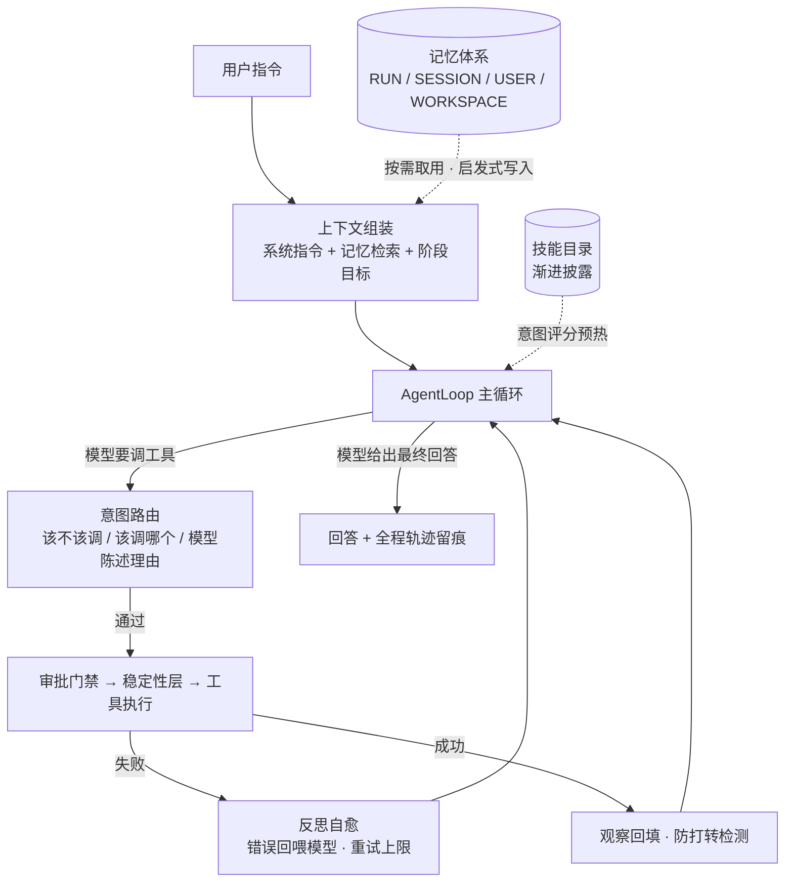
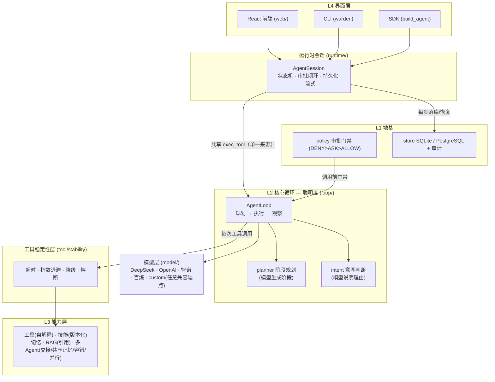

# Warden Agent

> 面向生产环境的 **可恢复、可治理** Agent 运行时（Agent Runtime）。
> 主流框架解决"Agent 有没有本事"，Warden 解决"Agent 敢不敢用"——
> 智能循环（规划 / 路由 / 自愈）× 多 Agent 协作 × RAG 溯源 × 执行治理与稳定性工程。

[](https://github.com/kwny-io/warden-agent/actions)
[](https://github.com/kwny-io/warden-agent/actions)
[](./pyproject.toml)
[](./pyproject.toml)
[](./LICENSE)

⚡ **30 秒体验**：`pip install -e . && python -m warden_agent.demo_e2e`
——**无需任何 API Key**，离线自主闭环：多 Agent 派工、知识检索、结构化交接，全程轨迹打印。

<!-- TODO(演示图): 录制 React 控制台或 demo_e2e 的 GIF，放到 docs/demo.gif 后取消下行注释

-->

## 核心亮点

### ① 会思考的认知循环——自己拆任务、自己纠错、自己分工

- **阶段规划**：复杂任务自动拆解为带目标的阶段、渐进注入推进；复杂任务的阶段由**模型生成**，
  离线降级为模板
- **意图路由**：调用前校验"该不该调、调哪个"；触发信号不足时**让模型陈述理由**——工具选择
  可解释、可审计，不是黑盒
- **反思自愈**：工具失败不崩溃，错误喂回模型自我纠正（带重试上限）；同一调用原样重发会被
  判定为打转并提示换策略
- **多 Agent 协作**：主管派工 + 结构化交接单 + 共享工作记忆 + 确定性并行分派，详见下文
  「Agent 智能架构」

### ② 执行治理五件套——有状态、有门禁、有账可查、可恢复、有契约

| 治理机制 | 对应传统系统设施 | Warden 的实现 |
|---|---|---|
| 受控状态机 | 事务状态约束 | 生命周期仅可经命名行为迁移，禁止任意跳转 |
| 审批门禁 | 风控与授权 | `DENY > ASK > ALLOW` 策略引擎，高危调用挂起待审，HTTP / CLI / 前端三端同一闭环 |
| 审计账本 | 操作审计 | 谁、何时、对哪个会话做了什么，落库可查 |
| 断点恢复 | 冲正与续作 | 每步落库 + 存档点，进程重启后续跑 |
| 服务契约 | 幂等与版本管理 | `Idempotency-Key` 幂等、统一版本头、problem+json 统一错误码 |

### ③ 工具稳定性层——把微服务 SRE 工程引入每一次工具调用

多数实现把重试与容错写在业务代码里；Warden 将其下沉为运行时的统一层，作用域是**每一次
工具调用**：超时护栏（卡死不停摆）→ 指数退避重试（扛瞬时故障与限流）→ 统一降级兜底
（重试耗尽走 fallback）→ 熔断保护（连续失败自动短路，冷却后半开试探）。它与审批门禁一样，
是调用前后必经的管卡，不是可选的示例代码。

### ④ 可测试性与评测是设计出来的，不是补出来的

- **离线确定性模型桩**：不配置任何 API Key 即可驱动完整链路——300 项测试零网络、零成本、
  可重复运行，正面回应 LLM 应用"测试靠真模型又贵又不稳定"的难题
- **Agent 评测黄金集**：意图路由（12 例）/ 技能触发（8 例）/ 端到端任务（6 例）三类黄金集，
  `python -m warden_agent.evals` 一键出报告，通过率可作 CI 质量门禁
- **确定性多 Agent 分派**：并行 / 串行由显式依赖决定，不依赖模型自由发挥，结果离线可复现
- **AST 架构边界测试**：分层依赖的单向性由测试守护，架构不靠自觉
- **mypy --strict 全量零错误**：77 个源文件在严格模式下通过类型检查

### ⑤ 能力"注册即路由"——自解释的工具与技能

工具触发词从描述自动提取（英文词元 + 中文双字 + 停用词过滤），新工具注册即可被意图路由命中，
无需手工维护映射表；意图判断在调用前校验"该不该调、调哪个"，无显式触发信号时由模型陈述
理由——**让每一次工具调用都带得通解释**。技能系统同源复用该信号：按意图评分选技能、
多版本并存、渐进披露。

### ⑥ 纵深防御——从策略层到执行层到存储层

- **策略层**：审批门禁决定"能不能调"
- **边界层**：工具 workdir 边界校验（防路径穿越）、Web 检索 URL 策略决定"能碰到哪"
- **执行层**：沙箱——只读工作区 + 默认禁网 + 资源限制（POSIX rlimit / Windows Job Object），
  经 `build_agent(sandbox=True)` 接入主链，暴露受控的 `shell.run` 工具
- **存储层**（独立模块）：凭证 AES-GCM 落库加密 + 短租约 + 脱敏

### ⑦ 模型无关——"大脑"可整体替换，治理与循环才是资产

- **四家内置**：DeepSeek / OpenAI / 智谱 / 阿里百炼，`.env` 填对应 key 即切换
- **custom 通用提供商**：零改源码接入**任意 OpenAI 兼容端点**（自建网关 / Ollama / vLLM / 硅基流动等）
- **实例直接注入**：`build_agent(provider=model)` 接受模型实例，多模型路由、灰度切换、测试替身皆宜
- **离线确定性模型桩**：不配任何 key 也能全链路运行与测试——这也是"模型可替换"的最终形态

## Agent 智能架构

Warden 的智能层不是"一次 prompt 调用"，而是一个带规划、路由、反思与记忆的完整认知循环。
按行业术语对应：ReAct 循环（工程化）· Plan-and-Execute 规划 · 反思自愈（Reflection）·
分层记忆 · 上下文工程 · 主管模式多智能体（Supervisor）。



**① 认知循环（ReAct 的工程化）**：感知 → 规划 → 路由 → 执行 → 观察。每一次工具调用前有
意图校验、中有稳定性层、后有观察回填；循环次数有上限，杜绝死循环。

**② 任务规划（Plan-and-Execute）**：先以确定性启发式判定任务复杂度；复杂任务拆解为带
目标的阶段（TaskPlan），阶段目标**渐进注入**——模型始终知道"当前在哪一步、下一步去哪"，
而不会闷头一口气做到忘掉全局。复杂任务的阶段计划由模型生成，离线时降级为通用模板；
规划全程留痕（role=system），与"可查账"纪律一致。

**③ 意图路由（可解释的工具选择）**：调用前校验"该不该调、该调哪个"。触发信号缺失时注入
提醒让模型确认或改选——**非阻断、可协商**，而非硬拒绝；同一"工具名 + 参数"成功调用重复
出现时判定为打转，提示模型换策略；无显式信号时由模型**陈述调用理由**。工具选择因此是
可解释、可审计的，不是黑盒。

**④ 反思自愈（失败是输入，不是异常）**：工具执行失败时，错误信息喂回模型自我纠正，带
按工具的重试上限；超上限则明确告知"此路不通"，促使换策略。实现细节：失败的调用不计入
打转签名——避免短路重试机制，这是绕不过去的工程分寸。

**⑤ 记忆体系（四级作用域 + 写入取舍）**：

- 作用域：`RUN`（单任务）/ `SESSION`（会话）/ `USER`（跨会话用户级）/ `WORKSPACE`
  （多 Agent 共享工作记忆）
- 取用端：按当前问题检索相关记忆注入上下文，按需取用而非全量倾倒
- 写入端：启发式判断"值不值得记"，值得才进入候选区，经确认后生效
- 配套：冲突消解、派生记忆（总结）、全程审计事件

**⑥ 上下文工程**：超长历史裁剪 + 早期内容压缩为要点摘要；与规划层的"阶段渐进注入"配合，
长任务的上下文占用保持有界——模型不会"越干越忘"。

**⑦ 多智能体（Supervisor + 结构化交接 + 确定性分派）**：

- **主管模式**：子 Agent 封装为工具，由主管调度
- **结构化交接单**：专员产出以（角色 / 任务 / 结论）结构化交接，干净可复核，不做全文灌水
- **共享工作记忆**：专员共用 WORKSPACE 记忆（研究员写入 → 写手直接读到），避免重复检索
- **容错降级**：子 Agent 失败 → 重试 / 切换备用专员 / 降级，不整体崩溃
- **确定性分派器**：独立任务线程池真并行、有依赖按序串行，纯代码路径、离线可精确测试；
  与主管组合成"主管动脑分工，分派器确定执行"

**⑧ RAG 与技能（让知识按需进入上下文）**：RAG 检索结果携带来源引用（SourceHit），回答
可溯源；技能系统（SKILL.md）采用渐进披露——平时只在目录，按任务意图评分预热、确认后才
注入正文，技能多版本并存、默认解析最新版本。

## 为什么需要 Warden

多数 Agent 框架止步于"能跑通一次对话"。进入真实业务后，需要回答的是另一类问题：
执行到一半进程崩溃了如何恢复？工具即将执行高危操作时由谁拦截？某次调用改了什么、由谁批准？
这些问题不解决，Agent 就无法进入生产。

Warden Agent 把**执行治理**作为一等公民：状态机约束执行生命周期、审批门禁提供
Human-in-the-loop 闭环、每一步持久化并留审计痕迹、存档点支持断点恢复。在此地基之上，
再叠加规划循环（阶段规划 / 意图判断 / 失败自愈）、能力层（工具 / RAG / 多 Agent / 技能）
与工具稳定性工程（超时 / 退避 / 降级 / 熔断）。

**典型场景**：需要审批留痕与审计合规的企业自动化；金融、政务等高危操作必须人工复核的行业；
Coding Agent 的 diff 门禁落地（不自动 commit/push，改动留成候选，人工决定）。

## 与主流框架的定位差异

| 路线 | 代表 | 核心问题 | 留给运行时的空白 |
|---|---|---|---|
| 能力编排框架 | LangChain / LlamaIndex | 如何组合模型、工具、RAG | 执行过程缺乏状态约束、门禁与审计 |
| 自主智能体 | AutoGPT / MetaGPT | 如何让 Agent 自主完成任务 | 失控风险高，难以进入受监管环境 |
| 图编排与检查点 | LangGraph | 可控的图执行与人工中断 | 验证了治理路线；审计、凭证、沙箱、稳定性仍需自行拼装 |

Warden 把这些空白收进一个统一运行时，并坚持一条纪律：**治理与稳定性不是可选项，而是每一次
工具调用的固定管卡**。检查点与人工中断已由 LangGraph 验证是正确方向——Warden 在同一方向上
提供更完整的体系化实现，并保持零依赖离线可测。

## 架构



层次说明：L4 提供三种等价接入形态（SDK / CLI / Web）；运行时会话 `AgentSession` 负责状态机、
审批闭环与持久化，并将规划执行委托给 `AgentLoop`；每次工具调用均先通过稳定性层
（超时 / 退避 / 降级 / 熔断）再进入能力层；审批门禁与持久化作为地基贯穿全程。
模型层面向 OpenAI 兼容协议抽象，可整体替换为任意兼容端点。

## 快速开始

环境要求：Python ≥ 3.12。

```bash
git clone https://github.com/kwny-io/warden-agent.git
cd warden-agent
pip install -e .
```

不配置任何模型密钥时，自动使用内置的离线确定性模型——循环、工具、审批、持久化等完整链路
可零成本运行与测试：

```python
from warden_agent.agent import build_agent

agent = build_agent()                     # 离线模式：确定性模型桩，不产生调用费用
print(agent.chat("上海天气怎么样"))
```

需要结构化输出时，将 Pydantic 模型交给 `typed_reply`：

```python
from pydantic import BaseModel

class Weather(BaseModel):
    city: str
    temp_c: float

result = agent.typed_reply(Weather, "上海现在多少度？")
```

`build_agent` 一行完成装配（模型 + 工具 + 策略 + 存储），并支持可选能力开关：
`memory`（记忆）、`skills`（技能）、`web`（联网检索）、`mcp_server`（MCP 工具源）、
`git_workdir`（Git 门禁工具）、`sandbox`（受控 `shell.run` 工具：只读副本 + 默认禁网 +
超时与输出预算约束）。

## 模型接入

在项目根目录放置 `.env`（参考 [.env.example](./.env.example)），密钥不进代码、不进仓库。
已内置四家 OpenAI 兼容提供商，填对应 key 即可切换：

| 提供商 | `provider` 取值 | 环境变量 |
|---|---|---|
| DeepSeek | `"deepseek"` | `DEEPSEEK_API_KEY` |
| OpenAI | `"openai"` | `OPENAI_API_KEY` |
| 智谱 GLM | `"zhipu"` | `ZHIPU_API_KEY` |
| 阿里百炼 | `"bailian"` | `DASHSCOPE_API_KEY` |

接入任意 OpenAI 兼容端点（自建网关 / Ollama / vLLM / 硅基流动等）**无需修改源码**：
在 `.env` 中配置三项，然后使用通用 `custom` 提供商：

```bash
WARDEN_API_KEY=你的key
WARDEN_BASE_URL=https://你的兼容端点/v1
WARDEN_MODEL=你的模型名
```

```python
agent = build_agent(provider="custom")
```

也可以直接构造模型实例注入（适合多模型路由、测试替身等场景）：

```python
from warden_agent.model.deepseek import create_model

model = create_model("custom", base_url="https://gateway.example.com/v1",
                     model="my-model", api_key="sk-...")
agent = build_agent(provider=model)
```

## 运行方式

### HTTP 服务

```bash
python -m warden_agent.web.run_server
```

- `http://127.0.0.1:8000/` —— 内置 React 控制台（SSE 流式对话 + 审批队列 + 状态面板）
- `http://127.0.0.1:8000/docs` —— 交互式 API 文档

| 方法 | 路径 | 说明 |
|---|---|---|
| POST | `/chat/{run_id}` | 同步对话，返回最终回答或审批请求 |
| POST | `/chat/stream/{run_id}` | SSE 流式对话 |
| GET | `/events/{run_id}` | SSE 事件流订阅 |
| GET | `/status/{run_id}` | 会话状态查询 |
| GET / POST | `/approvals` · `/approve/{run_id}` · `/reject/{run_id}` | 审批队列与决策 |
| GET | `/capabilities` · `/memory/{scope}` | 能力清单与记忆查询 |
| GET | `/health/live` · `/health/ready` · `/metrics` | 存活/就绪探针与指标 |
| GET | `/audit` | 审计轨迹（需认证） |

服务契约：统一版本头（`X-Warden-Api-Version`）、`Idempotency-Key` 请求幂等、
problem+json 统一错误码。可选开关（环境变量）：`WARDEN_API_KEY`（Bearer 认证）、
`WARDEN_AUDIT=1`（审计账本）、`GIT_WORKDIR`（将指定仓库暴露为 `git.apply_patch` 门禁工具）。

### CLI

```bash
warden health                                   # 服务健康检查
warden chat my-run "你好，介绍下自己"              # 对话（触发审批时给出提示）
warden stream my-run "讲讲多 Agent 协作"           # 流式对话
warden approvals                                 # 查看待审批队列
warden approve my-run                            # 批准 / warden reject my-run 拒绝
warden coding "给 hello.py 加一个 greet 函数"      # 本地编码任务：读代码 → 出 diff → 门禁落地
```

审批闭环在命令行同样成立：`chat` 触发审批 → `approvals` 查看队列 → `approve` / `reject` 决策。
CLI 默认连接 `http://127.0.0.1:8000`，可用 `WARDEN_BASE_URL` 覆盖；`coding` 为本地命令，不依赖服务。

### 演示脚本

```bash
python -c "from warden_agent.demo import run_deepseek_demo; run_deepseek_demo()"   # 真实模型对话
python -c "from warden_agent.demo import run_stream_demo; run_stream_demo()"       # 流式输出
python -m warden_agent.demo_e2e                                                    # 端到端完整链路
```

端到端演示将阶段规划、意图判断、RAG 来源引用、多 Agent 结构化交接与技能触发整条串联：
配置 `DEEPSEEK_API_KEY` 时走真实模型；未配置时由脚本化模型驱动**真实**的 AgentLoop，
主管派发调研与写稿专员、检索知识库、产出结构化交接单，完整 plan→act→observe 轨迹可见。

## 功能矩阵

| 模块 | 说明 | 状态 |
|---|---|---|
| 状态机（`core/run`） | 执行生命周期受控迁移，仅经命名行为变更，禁止任意跳转 | 已实现 |
| 模型抽象（`model/model.py`） | 统一模型接口，后端替换不影响上层 | 已实现 |
| 离线模型（`model/fake.py`） | 确定性离线模型桩，支撑无密钥运行与测试 | 已实现 |
| OpenAI 兼容模型（`model/deepseek.py`） | 单一实现覆盖 DeepSeek / OpenAI / 智谱 / 百炼 / custom：流式、工具调用、结构化输出、usage 统计 | 已实现 |
| 工具管线（`tool/catalog.py`） | 技能卡注册与调用集冻结；`pydantic_tool` 由 Pydantic 模型自动生成 Schema 并校验入参 | 已实现 |
| 工具稳定性层（`tool/stability.py`） | 超时护栏、指数退避重试、统一降级兜底、熔断保护（连续失败短路 + 冷却半开试探），按配置启用 | 已实现 |
| 工具自解释（`tool/trigger.py`） | 从工具描述自动提取触发词（英文词元 + 中文双字 + 停用词过滤），路由映射随注册自动生成 | 已实现 |
| 执行循环（`loop/loop.py`） | plan→act→observe 主循环，内置审批门禁 | 已实现 |
| 失败自恢复 | 工具错误回喂模型自纠，带重试上限 | 已实现 |
| 记忆取舍 | 记忆按需读取与启发式写入 | 已实现 |
| 阶段规划（`loop/planner.py`） | 复杂任务自动分解为阶段、渐进注入阶段目标；阶段由模型生成，离线降级为通用模板 | 已实现 |
| 上下文管理 | 超长历史裁剪 + 早期摘要 | 已实现 |
| 意图判断（`loop/intent.py`） | 调用前校验工具选择，无显式触发信号时由模型陈述理由 | 已实现 |
| SQLite 持久化（`store/sqlite.py`） | 存档点、线程安全、待审批持久化 | 已实现 |
| PostgreSQL（`store/postgres.py`） | 与 SQLite 同接口，可互换 | 已实现 |
| 迁移体系 + Codec（`store/`） | Schema 版本化演进，兼容历史数据 | 已实现 |
| 审批策略（`policy/policy.py`） | `DENY > ASK > ALLOW` 优先级门禁 | 已实现 |
| 运行时会话（`runtime/session.py`） | 状态机恢复、审批闭环、类型化结果 | 已实现 |
| HTTP/SSE 服务（`web/`） | 将 Agent 暴露为 API：对话、审批、事件流 | 已实现 |
| 服务契约（`web/server.py`） | 统一版本头、Idempotency-Key 幂等、problem+json 统一错误码 | 已实现 |
| 认证 / 审计 / 健康检查（`web/`） | Bearer 认证、审计账本、liveness/readiness 探针 | 已实现 |
| CLI（`cli.py`） | `warden` 命令族：chat / stream / approvals / approve / reject / health / caps / coding | 已实现 |
| RAG 检索（`rag/`） | 向量库 + `knowledge.search` 工具 | 已实现 |
| RAG 来源引用（`rag/knowledge.py`） | 检索结果携带 SourceHit，回答可溯源 | 已实现 |
| 多 Agent（`multiagent/`） | 主管模式，子 Agent 封装为工具 | 已实现 |
| 多 Agent 结构化交接 | 专员间以交接单（角色 / 任务 / 结论）传递，结果可复核 | 已实现 |
| 多 Agent 共享记忆 | 专员共享 WORKSPACE 工作记忆，避免重复检索 | 已实现 |
| 多 Agent 容错降级 | 子 Agent 失败时重试、切换备用专员或降级 | 已实现 |
| 多 Agent 并行分派（`multiagent/dispatch.py`） | 确定性分派器：线程池真并行或按依赖串行，行为可离线复现 | 已实现 |
| 技能系统（`skill/`） | SKILL.md 协议、渐进披露、信任快照 | 已实现 |
| 技能版本化 | 同一技能多版本并存，默认解析最新版本 | 已实现 |
| 技能触发 | 按任务意图评分选择技能，信号与意图路由同源 | 已实现 |
| 记忆（`memory/`） | 多作用域、候选确认、冲突消解、审计 | 已实现 |
| MCP 客户端（`mcp/` + `ts/mcp-client`） | TypeScript SDK 连接 MCP，工具先行审查再导入 | 已实现 |
| Web 搜索 / 抓取（`web/search.py`） | 多 provider 可插拔，URL 策略管控 | 已实现 |
| Git 集成（`git/`） | revision 探测、unified-diff 应用、合并门禁 | 已实现 |
| Coding Agent（`coding_agent/`） | 需求 → 读代码 → 生成 diff → 门禁落地 | 已实现 |
| Web 控制台（`web/`） | React + TypeScript + Tailwind + Vite：SSE 流式、审批队列、状态面板；FastAPI 单端口托管 | 已实现 |
| 配置加载（`core/config.py`） | `.env` 加载，密钥不进代码 | 已实现 |
| SDK 面（`agent.py`） | `build_agent` 一键装配、`typed_reply` 结构化输出、pydantic 工具 | 已实现 |
| 架构边界测试（`tests/`） | AST 校验模块依赖单向 | 已实现 |
| 凭证加密 + 租约（`credential/`） | AES-GCM 落库加密、短租约、脱敏 | 独立模块 |
| Checkpoint / 门禁（`runtime/`） | 断点恢复、失败重试、完成前校验 | 独立模块 |
| 受控执行（`execution/`） | 受管子进程、输出 / 超时 / 并发预算，经沙箱工具接入主链 | 已实现 |
| 执行沙箱（`execution/sandbox.py`） | 只读工作区、默认禁网、资源限制；`build_agent(sandbox=True)` 暴露受控 `shell.run` 工具 | 已实现 |
| Agent 评测集（`evals/`） | 三类黄金集：意图路由 12 例 / 技能触发 8 例 / 端到端任务 6 例；`python -m warden_agent.evals` 出报告，可作 CI 门禁 | 已实现 |

> **状态标注**：标注「独立模块」的组件已完成实现并通过测试，具备独立价值，但尚未接入产品
> 主链路（`build_agent` / HTTP / CLI）。文档与实际行为保持一致——已接入主链路的模块均真实生效。

## 工程质量

- **测试**：**300 项测试全量通过**（1 项 Postgres 集成测试在无数据库环境下自动跳过），覆盖状态机、工具稳定性层、执行循环、审批、持久化恢复、HTTP 契约、SSE 流式、RAG、多 Agent、技能系统、记忆、MCP、Git、Coding Agent、沙箱接线、凭证加密、端到端演示等
- **Agent 评测**：内置黄金评测集（26 例，三类），通过率作为 CI 质量门禁
- **类型检查**：`mypy --strict` 零错误（74 个源文件）
- **静态检查**：`ruff` 零告警
- **架构守护**：架构边界测试以 AST 校验分层依赖单向，防止层级倒挂
- **CI**：`ci.yml` 在每次 push 与 PR 时运行 `ruff` + `mypy --strict` + `pytest`
- **安全基线**：密钥经 `.env` 加载不进代码；`.gitignore` 屏蔽密钥、数据库与日志文件
- **确定性优先**：凡确定性可解的环节——多 Agent 分派、意图路由信号、离线测试替身——不交给模型自由发挥，行为可复现
- **失败是常态**：超时、重试、降级、熔断、断点恢复不是异常处理，而是内建的默认执行语义

## License

[MIT](./LICENSE)
